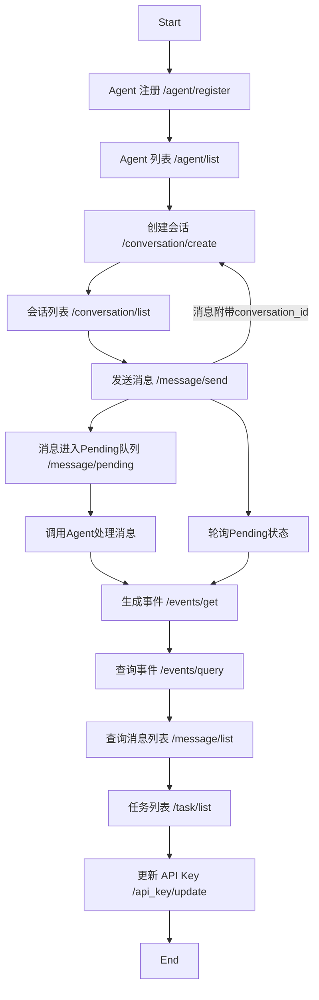

# Host Agent API 接口

**项目简介：**

本项目的目标是为 A2A的协调者和组织者的 Agent 提供启动和管理功能的 API 接口。通过这些接口，可以方便地和其它Agent进行交互，从而实现对其它Agent控制。


**快速开始：**

1.  **环境准备：**
    * 确保你的系统已经安装了 Python 3。
    * （如果项目有依赖）使用 pip 安装所需的依赖包：
        ```bash
        pip install -r requirements.txt
        ```
2. **配置模型：**
    * cp env_template.txt 为 .env 
    * 修改/hostAgentAPI/hosts/multiagent/host_agent.py中的模型，
    * model=LiteLlm(model="deepseek/deepseek-chat", api_key="xxx", api_base="")


3. **启动 API 服务：**
    * 在项目根目录下，运行以下命令启动 API 服务：
        ```bash
        python api.py
        ```
    * 默认情况下，API 服务可能会在本地的某个端口（例如 `http://localhost:13000`）启动。

## 请求流程图


## 代码解释
server.py里面定义了每个API的行为，修改API代码或者添加新的API的话，可以在其中操作。
例如/events/query就是新增的，在types.py里面定义返回消息的格式，在server.py中定义接口行为。

## Pycharm异常, 使用命令行python直接运行api.py即可
```
Exception ignored in: <function Task.__del__ at 0x104149080>
Traceback (most recent call last):
  File "/Users/admin/miniforge3/envs/multiagent/lib/python3.12/asyncio/tasks.py", line 150, in __del__
    self._loop.call_exception_handler(context)
    ^^^^^^^^^^^^^^^^^^^^^^^^^^^^^^^^^
AttributeError: 'NoneType' object has no attribute 'call_exception_handler'
2025-06-26 10:49:42,338 - [INFO] - _base_client - _sleep_for_retry - Retrying request to /chat/completions in 0.428395 seconds
/Applications/PyCharm.app/Contents/plugins/python/helpers/pydev/_pydevd_bundle/pydevd_pep_669_tracing.py:510: RuntimeWarning: coroutine 'TCPConnector._resolve_host_with_throttle' was never awaited
  frame = _getframe()
RuntimeWarning: Enable tracemalloc to get the object allocation traceback
```

**API 接口测试：**

项目提供了一个 `test_api.py` 脚本用于测试各个 API 接口的功能是否正常。

1.  **运行测试脚本：**
    * 确保 API 服务已经成功启动（见上面的“启动”步骤）。
    * 在项目根目录下，运行测试脚本：
        ```bash
        python test_api.py
        ```
    * 测试脚本将会输出每个接口的测试结果，帮助你验证 API 的可用性。


**API 接口测试：**

项目提供了一个 `test_api.py` 脚本用于测试各个 API 接口的功能是否正常。该脚本使用了 `unittest` 框架，对每个接口发送请求并验证响应。

1.  **运行测试脚本：**
    * 确保 API 服务已经成功启动（见上面的“启动”步骤）。
    * 在项目根目录下，运行测试脚本：
        ```bash
        python test_api.py
        ```
    * 测试脚本将会自动执行所有测试用例，并输出每个接口的测试结果，包括状态码、响应内容和耗时等信息，帮助你验证 API 的可用性。


**API 端点说明：**
| 流程步骤                   | 说明                              |
| ---------------------- | ------------------------------- |
| `/agent/register`      | 注册一个 Agent（例如某个模型服务）            |
| `/agent/list`          | 查看当前注册的 Agent                   |
| `/conversation/create` | 创建一个上下文会话（返回 `conversation_id`） |
| `/conversation/list`   | 列出所有创建过的会话                      |
| `/message/send`        | 向某个会话发送消息，绑定 `conversation_id`  |
| `/message/pending`     | 查询哪些消息还在处理中（Pending状态）          |
| `/events/get`          | 获取所有事件（消息发送、回复等）                |
| `/events/query`        | 查询某个 conversation_id 对应的事件     |
| `/message/list`        | 获取指定会话的所有消息                     |
| `/task/list`           | 查看当前所有调度任务                      |
| `/api_key/update`      | 更新当前系统使用的 API Key               |
