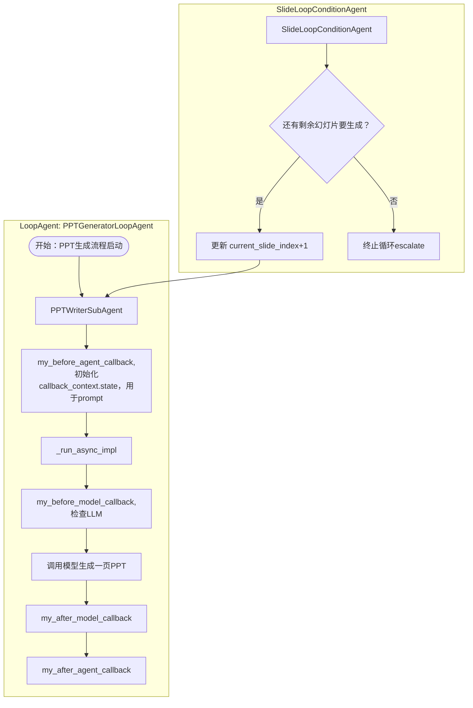

# 示例代码和对应的调用逻辑
## 大概调用原理



## 示例代码：
```
import json
from typing import Dict, List, Any, AsyncGenerator, Optional, Union
from google.genai import types
from google.adk.agents.llm_agent import LlmAgent  # Renamed Agent to LlmAgent for clarity/convention
from google.adk.agents import LoopAgent, BaseAgent  # Import LoopAgent and BaseAgent
from google.adk.events import Event, EventActions
from google.adk.agents.invocation_context import InvocationContext
from google.adk.agents.callback_context import CallbackContext
from google.adk.models import LlmRequest, LlmResponse
from ...config import PPT_WRITER_AGENT_CONFIG
from ...create_model import create_model
from . import prompt

def my_before_model_callback(callback_context: CallbackContext, llm_request: LlmRequest) -> Optional[LlmResponse]:
    # 1. 检查用户输入
    agent_name = callback_context.agent_name
    history_length = len(llm_request.contents)
    metadata = callback_context.state.get("metadata")
    print(f"调用了{agent_name}模型前的callback, 现在Agent共有{history_length}条历史记录,metadata数据为：{metadata}")
    #清空contents,不需要上一步的拆分topic的记录, 不能在这里清理，否则，每次调用工具都会清除记忆，白操作了
    # llm_request.contents.clear()
    # 返回 None，继续调用 LLM
    return None
def my_after_model_callback(callback_context: CallbackContext, llm_response: LlmResponse) -> Optional[LlmResponse]:
    # 1. 检查用户输入，注意如果是llm的stream模式，那么response_data的结果是一个token的结果，还有可能是工具的调用
    agent_name = callback_context.agent_name
    response_parts = llm_response.content.parts
    part_texts =[]
    for one_part in response_parts:
        part_text = one_part.text
        if part_text is not None:
            part_texts.append(part_text)
    part_text_content = "\n".join(part_texts)
    metadata = callback_context.state.get("metadata")
    print(f"调用了{agent_name}模型后的callback, 这次模型回复{response_parts}条信息,metadata数据为：{metadata},回复内容是: {part_text_content}")
    #清空contents,不需要上一步的拆分topic的记录, 不能在这里清理，否则，每次调用工具都会清除记忆，白操作了
    # llm_request.contents.clear()
    # 返回 None，继续调用 LLM
    return None

# --- 1. Custom Callback Functions for PPTWriterSubAgent ---
def my_before_agent_callback(callback_context: CallbackContext) -> None:
    """
    在调用LLM之前，从会话状态中获取当前幻灯片计划，并格式化LLM输入。
    """
    slides_plan: List[Dict[str, Any]] = callback_context.state.get("slides_plan")
    current_slide_index: int = callback_context.state.get("current_slide_index", 0)  # Default to 0

    if not slides_plan:
        raise ValueError("slides_plan is missing in session state. Please ensure SlidePlannerAgent ran successfully.")

    if current_slide_index >= len(slides_plan):
        # This should ideally be handled by SlideLoopConditionAgent, but as a safeguard
        print(
            f"Warning: current_slide_index ({current_slide_index}) out of bounds for slides_plan ({len(slides_plan)}).")
        return LlmResponse(
            content=types.Content(role="model", parts=[types.Part(text="")]))  # Return empty to skip LLM call

    summary_document: str = callback_context.state.get("summary_document")
    if not summary_document:
        raise ValueError("summary_document is missing in session state. Please ensure SummaryAgent ran successfully.")

    # 获取当前需要处理的幻灯片大纲
    current_slide_plan = slides_plan[current_slide_index]

    # 格式化当前幻灯片大纲，使其符合XML_PPT_AGENT_PROMPT的{outline}输入
    # XML_PPT_AGENT_PROMPT期望一个文本格式的大纲，而不是JSON对象
    formatted_slide_outline = f"Page {current_slide_plan.get('page', current_slide_index + 1)}: {current_slide_plan.get('title', 'Untitled')}\n"
    formatted_slide_outline += f"Summary: {current_slide_plan.get('summary', 'No summary.')}\n"
    if current_slide_plan.get('key_points'):
        formatted_slide_outline += "Key Points:\n"
        for kp in current_slide_plan['key_points']:
            formatted_slide_outline += f"- {kp}\n"

    print(f"--- 正在生成第 {current_slide_index + 1}/{len(slides_plan)}: {current_slide_plan.get('title')} ---")

    # 第一页的prompt和后面ppt的页的prompt是不一样的，因为后面页的prompt需要继续前一页的继续生成
    # 构建LLM请求的contents
    callback_context.state["one_slide_outline"] = formatted_slide_outline
    callback_context.state["research_doc"] = summary_document
    # 第一页和其它页只有历史记录和页码不一样
    if current_slide_index == 0:
        # 用于初始化prompt
        callback_context.state["page_num"] = 1
        callback_context.state["history_slides_xml"] = ""
    else:
        all_generated_slides_content: List[str] = callback_context.state.get("generated_slides_content", [])
        history_slides_xml = "\n\n".join(all_generated_slides_content)
        callback_context.state["page_num"] = current_slide_index + 1
        callback_context.state["history_slides_xml"] = history_slides_xml
    # 返回 None，继续调用 LLM
    return None


def my_after_agent_callback(callback_context: CallbackContext) -> None:
    """
    在LLM生成内容后，将其存储到会话状态中。供下一页ppt生成使用
    """
    model_last_output_content = callback_context._invocation_context.session.events[-1]
    response_parts = model_last_output_content.content.parts
    part_texts =[]
    for one_part in response_parts:
        part_text = one_part.text
        if part_text is not None:
            part_texts.append(part_text)
    part_text_content = "\n".join(part_texts)
    # 获取或初始化存储所有生成幻灯片内容的列表
    all_generated_slides_content: List[str] = callback_context.state.get("generated_slides_content", [])
    all_generated_slides_content.append(part_text_content)

    # 更新会话状态
    callback_context.state["generated_slides_content"] = all_generated_slides_content
    print(f"--- Stored content for slide {callback_context.state.get('current_slide_index', 0) + 1} ---")


class PPTWriterSubAgent(LlmAgent):
    async def _run_async_impl(self, ctx: InvocationContext) -> AsyncGenerator[Event, None]:
        slides_plan: List[Dict[str, Any]] = ctx.session.state.get("slides_plan")
        current_slide_index: int = ctx.session.state.get("current_slide_index", 0)
        # 清空历史记录，防止历史记录进行干扰
        ctx.session.events = []
        if current_slide_index == 0:
            # 在第一个子Agent返回前返回 XML 开头
            yield Event(
                author=self.name,
                content=types.Content(parts=[types.Part(text="""```xml
<PRESENTATION>""")]),
            )
        # 调用父类逻辑（最终结果）
        async for event in super()._run_async_impl(ctx):
            print(f"{self.name} 收到事件：{event}")
            yield event
        if current_slide_index == len(slides_plan) - 1:
            # 在最后一个子Agent返回后返回 XML 结尾
            yield Event(
                author=self.name,
                content=types.Content(parts=[types.Part(text="""
</PRESENTATION>```""")]),
            )

# --- 2. PPTWriterSubAgent (The Worker Agent) ---
# 这个代理负责根据单页大纲生成XML内容
ppt_writer_sub_agent = PPTWriterSubAgent(
    model=create_model(model=PPT_WRITER_AGENT_CONFIG["model"], provider=PPT_WRITER_AGENT_CONFIG["provider"]),
    name="PPTWriterSubAgent",
    description="根据每一页的幻灯片计划内容，写出完整的XML格式的PPT单页内容",
    instruction=prompt.XML_PPT_AGENT_NEXT_PAGE_PROMPT,
    before_agent_callback=my_before_agent_callback,
    after_agent_callback=my_after_agent_callback,
    before_model_callback=my_before_model_callback,
    after_model_callback=my_after_model_callback
)


def my_before_agent_callback(callback_context: CallbackContext):
    """
    在Loop Agent调用之前，进行数据处理
    :param callback_context:
    :return:
    """
    # print(callback_context)
    # 获取slides_plan，变成dict格式，方便后续使用
    slides_plan = callback_context.state.get("slides_plan")
    try:
        # 清理可能的Markdown代码块
        if isinstance(slides_plan, str):
            if slides_plan.strip().startswith("```json"):
                slides_output = slides_plan.strip()[7:-3]
            elif slides_plan.strip().startswith("```"):
                slides_output = slides_plan.strip()[3:-3]
            else:
                slides_output = slides_plan
            slides_plan_data = json.loads(slides_output)
        else:
            slides_plan_data = slides_plan
        # 存储到slides_plan中
        callback_context.state["slides_plan"] = slides_plan_data
    except (json.JSONDecodeError, AttributeError) as e:
        print(f"Error: 错误，不能解析 slides_plan JSON - {e}")
    return None

# --- 3. SlideLoopConditionAgent (The Condition Checker) ---
# 这个代理负责更新当前幻灯片索引，并决定是否继续循环
class SlideLoopConditionAgent(BaseAgent):
    async def _run_async_impl(self, ctx: InvocationContext) -> AsyncGenerator[Event, None]:
        slides_plan: List[Dict[str, Any]] = ctx.session.state.get("slides_plan")
        current_slide_index: int = ctx.session.state.get("current_slide_index", 0)

        if not slides_plan:
            # 如果没有 slides_plan，则直接结束循环 (可能在前面步骤出错), 幻灯片的生成计划是必须的
            print("No slides_plan found. Terminating loop.")
            yield Event(author=self.name, actions=EventActions(escalate=True))
            return

        # 检查是否所有幻灯片都已处理
        is_done = (current_slide_index >= len(slides_plan))

        if is_done:
            print(f"--- All {len(slides_plan)} slides processed. Terminating loop. ---")
            yield Event(author=self.name, actions=EventActions(escalate=True))  # 提升事件，停止循环
        else:
            # 如果还有未处理的幻灯片，则更新索引并继续
            new_slide_index = current_slide_index + 1
            ctx.session.state["current_slide_index"] = new_slide_index
            print(f"--- 开始生成第 {new_slide_index + 1} / {len(slides_plan)} 幻灯片---")
            yield Event(author=self.name, actions=EventActions())  # 不提升事件，继续循环

# --- 4. PPTGeneratorLoopAgent ---
ppt_generator_loop_agent = LoopAgent(
    name="PPTGeneratorLoopAgent",
    max_iterations=100,  # 设置一个足够大的最大迭代次数，以防万一。主要依赖ConditionAgent停止。
    sub_agents=[
        ppt_writer_sub_agent,  # 首先生成当前页的内容
        SlideLoopConditionAgent(name="SlideCounter"),  # 然后检查并更新索引，决定是否继续
    ],
    before_agent_callback=my_before_agent_callback,
)

```